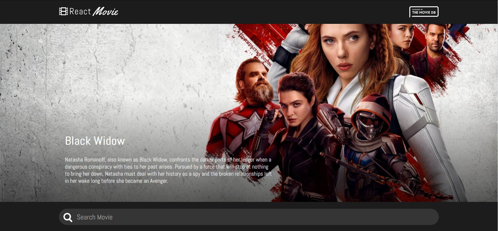

## React Calculator App

<p align="center">
  
</p>

## Live Version

* [Live Demo](https://movie-data-base-scs.netlify.app/) 

<br />

## Table of Contents

<br />

* [About the Project](#about-the-project)
* [Built With](#built-with)
* [How to play](#how-to-play) 
* [Contributing](#contributing)
* [Contact](#authors)
* [Acknowledgements](#acknowledgements) 
* [Getting Started](#getting-started) 
* [Live Demo](#live-version) 

<br />

 <br/>
 <br/>
 <br/>

## Screenshot

<p align="center">
  
</p>

### Built With

* [JAVASCRIPT] [REACT] 

<br />


## About The Project

The React movie database offers users the possibility to check on the latest trending movies there is. as well they can filter by their choice movie and check specific specs of it such as director, budget, cast and bio. 

<br />


## Contributing

Contributions make the open-source community such an amazing place to learn, inspire, and create. Any contributions you make are **greatly appreciated**.

## Prerequisites

Terminal or similar to execute the program.


## Getting Started


## Clone project
- To get a local copy up and running follow these simple example steps.
- Clone this repository with git clone ```https://github.com/sergiocortessat/React-scs-movie-database``` using your terminal or command line.
- Change to the project directory by entering: ```cd React-scs-movie-database``` in the terminal.
- Enter the command npm i
- Enter the project folder and run locally by using npm start.

## Command line steps
```
- $ git clone `$ git clone https://github.com/sergiocortessat/React-scs-movie-database/
- $ git checkout develop
- $ cd React-scs-movie-database
- $ npm i
- $ npm start
```

<!-- ## Testing

The testing has been performed using Jest Framework. 

- To run the test please open the command line
- Enter npm run test to run the testing once.
- Enter npm run watch to keep jest test open

```
- $ cd React_Calculator1
- $ npm run test

```
 -->


## Authors

👤 Sergio Cortes Satizabal

- Github: [@sergiocortessat](https://github.com/sergiocortessat)
- Twitter: [@sergiocortessat](https://twitter.com/sergiocortessat)
- LinkedIn: [@sergiocortessat](https://linkedin.com/in/sergiocortessat)


<!-- ACKNOWLEDGEMENTS -->
## Acknowledgements

* [Microverse](https://www.microverse.org/)

## 📝 License

This project is [MIT](https://github.com/sergiocortessat/sergiocortessat/blob/main/LICENSE) licensed.
